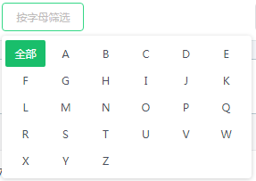

# 公共UI

## 常用按钮


```html
<Button disabled class="g-btn-gray">返回</Button>
<Button disabled class="g-btn-default">取消</Button>
<Button disabled class="g-btn-cancel">取消</Button>
<Button disabled type="success">同意</Button>
<Button disabled type="warning">拒绝</Button>
<Button disabled  type="text">Text</Button>
<br /><br />

<Button class="g-btn-gray">返回</Button>
<Button class="g-btn-default">取消</Button>
<Button class="g-btn-cancel">取消</Button>
<Button type="success">同意</Button>
<Button type="warning">拒绝</Button>
<Button  type="text">Text</Button>

<br /><br />

<Button size="large" class="g-btn-gray">选择人员</Button>
<Button size="large" class="g-btn-default">取消按钮</Button>
<Button size="large" class="g-btn-cancel">取消</Button>
<Button size="large" type="success">新增按钮</Button>
<Button size="large" type="warning">错误</Button>
<Button size="large"  type="text">Text</Button>

<br /><br />

<Button size="small" class="g-btn-gray">选择人员</Button>
<Button size="small" class="g-btn-default">取消</Button>
<Button size="small" class="g-btn-cancel">取消</Button>
<Button size="small" type="success">新增按钮</Button>
<Button size="small" type="warning">错误按钮</Button>
<Button size="small"  type="text">Text</Button>
```

## 面包屑


```html
<div class="g-breadcrumb">
	<Breadcrumb class="g-breadcrumb-inner" separator=">">
		<Breadcrumb-item>首页</Breadcrumb-item>
		<Breadcrumb-item>应用中心</Breadcrumb-item>
		<Breadcrumb-item>某应用</Breadcrumb-item>
	</Breadcrumb>
</div>
```


## 单页面模板


```html
<layout-child>
	<div slot="body">内容</div>
</layout-child>
```
```html
<layout-child>
	<router-view slot="body"></router-view>
</layout-child>
```


## 两栏页面模板


```html
<layout-child type="two">
	<div slot="menu">
		左栏
	</div>
	<div slot="body">
		内容
	</div>
</layout-child>
```
示例：

```html
<layout-child type="two">
	<div slot="menu">
		<Menu active-name="1" class="menu"  width="auto">
		  <Menu-group title="演示模板">
			<router-link to="/demo/home/main">
			  <Menu-item name="1">
				<Icon type="arrow-right-b"></Icon>
				主页
			  </Menu-item>
			</router-link>
			<router-link to="./list">
			  <Menu-item name="2">
				<Icon type="arrow-right-b"></Icon>
				列表
			  </Menu-item>
			</router-link>
			<router-link to="./ctrl">  
			  <Menu-item name="3">
				<Icon type="arrow-right-b"></Icon>
				控件
			  </Menu-item>
			</router-link>
			<router-link to="./test">  
			  <Menu-item name="4">
				<Icon type="arrow-right-b"></Icon>
				测试
			  </Menu-item>
			</router-link>
			<Submenu name="sub1">
			  <template slot="title">
				子菜单
			  </template>
			  <Menu-item name="index1" >
				<Icon type="arrow-right-b"></Icon>
				菜单1
			  </Menu-item>
			</Submenu>
		  </Menu-group>
		</Menu>
	</div>
	<router-view slot="body"></router-view>
</layout-child>
```
显示折叠按钮配置:

```html
<layout-child type="two" :config="{ showButton:true,level:1 }">
       <!--....-->
</layout-child>
```
showButton控制显示，level控制是否自动展开，当level>=4时会自动展开


## 固定滚动区域


参数 config中指定要排除的元素cls: id 或 class,cls参数支持多个，匹配多个时将累积,适用于头部或底部分页固定，中间内容超过屏幕需要滚动的场景。
参数offset支持用具体数字来计算高度。

```html
	<div>
		<div class="g-breadcrumb" id="demo_top">
			<Breadcrumb class="g-breadcrumb-inner" separator=">">
					<Breadcrumb-item>首页</Breadcrumb-item>
					<Breadcrumb-item>应用中心</Breadcrumb-item>
					<Breadcrumb-item>某应用</Breadcrumb-item>
			</Breadcrumb>
		</div>
		<fixed-height :config="{ cls:['#demo_top'] }">
			<div style="height:1200px">滚动<br/>内容<br/><br/><br/>。。</div>到底了。
		</fixed-height>
	</div>
```

其他用法

```html
	<fixed-height v-model="myHeight"></fixed-height>
        <!--  {{myHeight}}  -->
        <!--  关联v-model后返回的值，可以做更高级的应用 -->
```


## 统计图表

?>  官方文档参考 [https://github.com/apertureless/vue-chartjs](https://github.com/apertureless/vue-chartjs)


## 日历控件

?> 文档参考 [https://fullcalendar.io/docs/](https://fullcalendar.io/docs/)

用法示例：

```js
import fullcalendar from '@/components/common/fullcalendar';

export default {
        // ...
        components: {
            fullcalendar
        },
        data:{
            return {
                conf:{
                    header: {
                            left: 'prev,next today',
                            center: 'title',
                            right: 'month,basicWeek,basicDay'
                    },
                    defaultDate: '2017-05-12',
                    navLinks: true, // can click day/week names to navigate views
                    editable: true,
                    eventLimit: true, // allow "more" link when too many events
                    events: [
                            {
                                    title: 'All Day Event',
                                    start: '2017-05-01'
                            },
                            {
                                    title: 'Long Event',
                                    start: '2017-05-07',
                                    end: '2017-05-10'
                            },
                            {
                                    id: 999,
                                    title: 'Repeating Event',
                                    start: '2017-05-09T16:00:00'
                            },
                            {
                                    id: 999,
                                    title: 'Repeating Event',
                                    start: '2017-05-16T16:00:00'
                            },
                            {
                                    title: 'Conference',
                                    start: '2017-05-11',
                                    end: '2017-05-13'
                            },
                            {
                                    title: 'Meeting',
                                    start: '2017-05-12T10:30:00',
                                    end: '2017-05-12T12:30:00'
                            },
                            {
                                    title: 'Lunch',
                                    start: '2017-05-12T12:00:00'
                            },
                            {
                                    title: 'Meeting',
                                    start: '2017-05-12T14:30:00'
                            },
                            {
                                    title: 'Happy Hour',
                                    start: '2017-05-12T17:30:00'
                            },
                            {
                                    title: 'Dinner',
                                    start: '2017-05-12T20:00:00'
                            },
                            {
                                    title: 'Birthday Party',
                                    start: '2017-05-13T07:00:00'
                            },
                            {
                                    title: 'Click for baidu',
                                    url: 'http://baidu.com/',
                                    start: '2017-05-28'
                            }
                    ]
            }
            }
        },
}
```


```html
	<fullcalendar :config="conf"></fullcalendar>
```

## 头像显示


size是头像宽高。uid指定用户，默认为当前用户。无头像用户展示名称首字。

```html
	<go-avatar :size="40" />
	<go-avatar :uid="100000100" :size="40" />
```

## 加载中


根据业务，有的地方需要显示该状态，请根据业务控制其显示状态。

```html
	<go-loading />
```

## 图片预览

```html
	<go-imgview link="123.jpg">预览</go-imgview>
	<go-imgview link="123.jpg"><go-avatar :size="40" /></go-imgview>
```


## tab组件


```html
<div class="g-tabs">
    <Tabs type="card">
        <Tab-pane label="处理中">标签一的内容</Tab-pane>
        <Tab-pane label="退回">标签二的内容</Tab-pane>
        <Tab-pane label="审批异常">标签三的内容</Tab-pane>
    </Tabs>
</div>
```

## 分页组件


```html
<go-page :total="100" :showSizeChanger="true" />
```
参数

名称|类型|默认值|描述
---|---|----------|---
current|Number||当前页数
total|Number|0|数据总数
pageSize|Number||每页条数, 当同时配置pageSizeOptions的时候并且showSizeChanger为true的时候，优先使用pageSizeOptions，否则将会使用该参数
defaultPageSize|Number|10|默认的每页条数，只有当showSizeChanger为false并且pageSize没有配置的时候才会生效
showSizeChanger|Boolean|false|是否显示 pageSize 选择框以及决定pageSizeOptions是否生效
pageSizeOption|Array|[10, 20, 30, 40]|指定每页可以显示多少条

事件

名称|描述
---|---
pageChange|当页码改变的时候触发
pageSizeChange|当pageSize改变的时候触发


## 按字母筛选



```html
<go-letter-filter size="small" v-model="value" @on-change="" />
```

## 按部门筛选


```html
<go-type-filter size="small"  type="dept" v-model="value" @on-change=""  />
```

## 按角色筛选


```html
<go-type-filter size="small" type="role" v-model="value" @on-change=""  />
```

## 按职位筛选


```html
<go-type-filter size="small" type="pos" v-model="value" @on-change=""  />
```

## 日期筛选


```html
<go-datepicker size="small" noform v-model="value" placeholder="选择日期" format="yyyy-MM-dd" />
```

## 其他筛选


```html
<go-type-filter size="small" placeholder="其他选择" type="other" v-model="value" @on-change="">
    <Option value="1">男</Option>
    <Option value="2">女</Option>
</go-type-filter>
```

## 搜索框


```html
<go-type-filter size="small" type="find" placeholder="姓名/工号" v-model="value" @on-click=""  />
```

## 人员/部门展示


member_ids,department_ids 分别对应人员id和部门id，支持多个以逗号分隔字符，id数组

```html
<go-people :department_ids="value" :member_ids="value2"><Button>选择人员</Button></go-people>
```

## 常用表单控件


```html
  <table class="g-form">
    <tr class="in-tr">
        <td class="in-hd">
            姓名 <span class="in-star">*</span>
        </td>
        <td>
            <mu-text-field v-model="value"  errorText="这是必填项" hintText="请输入姓名"/>
        </td>
    </tr>
    <tr class="in-tr">
        <td class="in-hd">
            下拉单选 <span class="in-star">*</span>
        </td>
        <td>
            <go-type-filter form placeholder="下拉选择" type="other" v-model="value" @on-change="">
                <Option value="1">男</Option>
                <Option value="2">女</Option>
            </go-type-filter>
        </td>
    </tr>
    <tr class="in-tr">
        <td class="in-hd">
            日期选择 <span class="in-star"></span>
        </td>
        <td>
                <go-datepicker v-model="value2" errorText="这是必填项"  placeholder="选择日期" format="yyyy-MM-dd" />
        </td>
    </tr>
    <tr class="in-tr">
        <td class="in-hd">
            时间选择 <span class="in-star"></span>
        </td>
        <td>
                <go-timepicker v-model="value2" placeholder="选择时间" format="HH:mm" />
        </td>
    </tr>
    <tr class="in-tr">
        <td class="in-hd">
            区域选择 <span class="in-star"></span>
        </td>
        <td>
                <go-city v-model="valarr" errorText="这是必填项"></go-city>
        </td>
    </tr>
    <tr class="in-tr">
        <td class="in-hd">
            姓名 <span class="in-star">*</span>
        </td>
        <td>
            <mu-text-field v-model="value2" errorText='' hintText="请输入姓名"/>
        </td>
    </tr>
    <tr class="in-tr">
        <td class="in-hd">
            性别 <span class="in-star"></span>
        </td>
        <td>
            <div>
                <mu-radio label="男" name="group" nativeValue="simple1" v-model="value" style="margin-right:40px" />
                <mu-radio label="女" name="group" nativeValue="simple2" v-model="value"/>
            </div>
        </td>
    </tr>
    <tr class="in-tr">
        <td class="in-hd">
            多选 <span class="in-star"></span>
        </td>
        <td>
            <div>
                <mu-checkbox name="group2" nativeValue="checkbox1" v-model="list" label="选择1" style="margin-right:40px" />
                <mu-checkbox name="group2" nativeValue="checkbox2" v-model="list" label="选择2" />
            </div>
        </td>
    </tr>
    <tr class="in-tr">
        <td class="in-hd">
            个人说明 <span class="in-star"></span>
        </td>
        <td>
                <mu-text-field :maxLength="10" errorText="这是必填项" hintText="请输入...." multiLine :rows="3" :rowsMax="999"/>
        </td>
    </tr>
    <tr class="in-tr">
        <td class="in-hd">
            &nbsp;
        </td>
        <td>
                <Button class="g-btns g-btn-mg g-btn-default" size='large'>取消</Button>
                <Button class="g-btns g-btn-mg" type="success" size='large'>保存</Button>
                <Button class="g-btns g-btn-right" type="success" size='large'>保存并新增</Button>
        </td>
    </tr>
</table>
```

## 常用弹窗

```
<Modal class="g-dialog-default" v-model="showDialog" :closable="false">
    <div class="title">标题</div>
    <div style="position:relative;min-height:300px">
        ....内容自定
    </div>
    <div slot="footer">
        <Button size="large" class="g-btn-no" type="text" @click="showDialog=false">取消</Button>
        <Button size="large" class="g-btn-yes" type="text" @click="">确认</Button>
    </div>
</Modal>
```

导入类


常规类


----------
　

　

　

　

　

　

　

　

　

　


