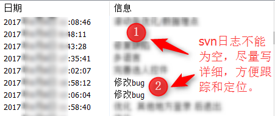
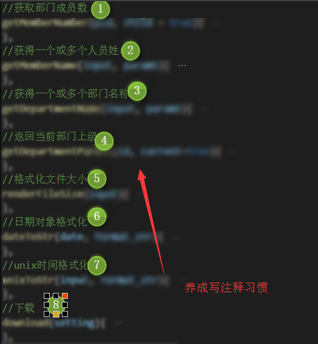

# 开发指南

## 功能移交测试规范

请养成开发完以后，自测一次或前端人员之间互相测试一次对方开发的功能，确认没问题才移交测试。 减少出现初级bug的几率。

## 提交检查规范

提交代码前，请先检查```浏览器控制台```和```命令控制台```是否有错误和警告。

## 代码提交日志规范



## 注释规范




## 提示语、原型、UI规范

开发过程中，请遵循以下基本原则：

```
原型：请以共享资源中最新原型为准。
提示语：请严格参考原型和全局规范提供的文案编码。
UI：请以共享资源中最新UI规范、效果图规范为准。

```


```
不能擅自更改和自己添加一些额外提示语。若有需要请先和产品部人员沟通并确认。
不要擅自调整，若有需要，及时联系产品部和UI人员沟通确认。
```


----------
　

　

　

　

　

　

　

　

　

　


