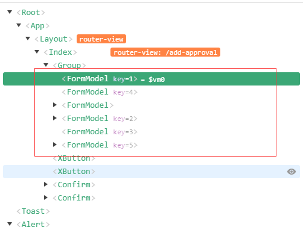
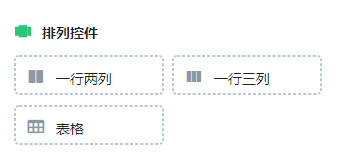
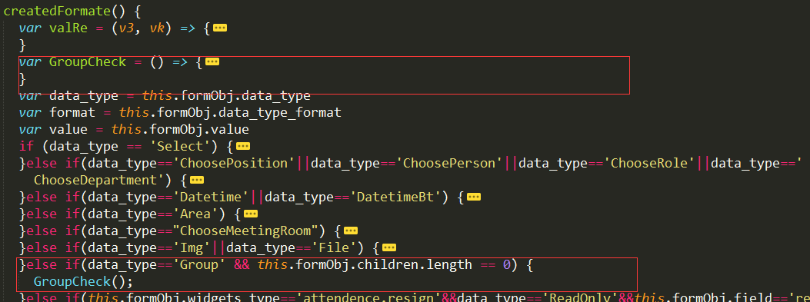

# 发起审批
发起审批，审批主页选择某个流程点击进入，即可开始发起审批。（想要看懂以下的文档，需要有一定的vue基础）
## 获取流程模板
在审批主页点击某个流程，即跳转到流程的发起页面。通过点击的流程process_id，调用流程详情接口即可获取到该流程的详细内容。例如流程名称，流程模板等等。
具体可查看src/pages/index/approval/addApproval/index.vue文件下的getFormData方法。

这里对代码做部分展示
```js
getFormData() { //获取表单模板数据
  if (!this.process_id) return false;
  this.loading = true
  this.$http.post('/api/flow_center/v3/process_tpl_detail', {
    process_id: this.process_id
  }).then((res) => {
    this.loading = false
    if (res.data.code == 0) {
      ...
    }
  })
}    
```
## 控件列表
拿到流程模板内容中的widgets，准备渲染。这里的widgets是一个数组，数组里面的每一个元素都是一个控件。这里展示一下数组中的一个元素，所有的控件数据格式都一样。
```js
{
  "control_id": 201895,
  "company_id": 43204,//当前公司id
  "process_id": 33549,//流程id
  "special_type": 0,//特殊类型，有些内容需要用到该参数，例如任务书
  "widgets_type": "attendence.leave",//判断当前流程是什么，当前表示请假，可用来判断是否需要执行计算请假天数的方法
  "title": "剩余假期",//控件标题
  "data_type": "ReadOnly",//判断该控件是属于什么控件，当前表示只读控件
  "data_type_format": "text",//判断是否是金额或数字，
  "placeholder": "",//空白时候的占位符
  "check_rule": {},//控件的详细规则，例如必填，格式化方式将保存在这里
  "data_list": [],//控件的备选项，单选，多选，下拉列表会用到
  "data_list_type": "",
  "data_list_filter": "",
  "field": "leave_time_left",//字段名，发起审批传给后端值的key
  "default_data": "",
  "unit": "天",//单位
  "visible": 0,//是否可见，0不可见，1可见
  "can_delete": 0,
  "can_change_field": [],
  "status": 1,
  "func": {},//计算方法，某些控件需要计算内部的值，例如请假时长，需要用该参数里面的url调接口计算值
  "sort": 0,
  "value": "",//初始值
  "obj_id": 19,//也可根据该值判断当前是属于什么控件
  "parent_id": 0,
  "group_setting": {},
  "data_list_all": []
}
```
## 控件库
将每个基础控件的样式，数据处理方法准备好，写在同一个文件下。

例如：项目目录下的文件src/components/form/basic-form.vue

这里展示其中的单行文本
```html
<!-- 单行文本 -->
<div class="single" :class="{table_fix: is_table,'vux-1px-b': !is_table}" v-if="formObj.data_type=='Input'&&(formObj.data_type_format=='text'||!formObj.data_type_format)">
  <span class="label_area">{{formObj.title}}<span class="star" v-if="is_needed">*</span></span>
  <div class="content_area">
    <input @input="editContent" v-model="formObj.value" type="text" class="ipt_area" :placeholder="formObj.placeholder" maxlength="100">
  </div>
  <div class="mask" v-if="!can_edit"></div> //这一段代码是一个遮罩层，当当前控件不能编辑的时候，就用该遮罩层挡住。
</div>
```
每个控件都是有一个指定的渲染条件，观察上述代码中v-if内部的内容。当"formObj.data_type=='Input'&&(formObj.data_type_format=='text'||!formObj.data_type_format)"该条件满足时，这个单行文本区将会展示并被使用。
该文件包含了所有的22个基础控件。


还需要说的内容就是，每个控件需要的数据格式不一样，所以在文档被渲染之前，需要按照要求，将后端返回来的值格式化为指定的格式。具体可查看该文件下的createFormat方法

这里对该方法做部分展示
```js
//初始化数据
createdFormate() {
  ...
  if (data_type == 'Select') {
    let result = []
    try{
      result = JSON.parse(value)
    }catch(e) {
      result = []
    }
    if(format !='multiple') {
      this.pick_value = (result[0]||{}).value?[(result[0]||{}).value]:[]
    }
  }
  ...
}
```
## 开始渲染
通过遍历上面获取到的控件列表数据，来渲染整个表单。
```html
<!-- 无布局 -->
<template v-else>
  <formModel 
    v-for="widget,order in form_info.widgets" 
    :key="order" 
    :formObj="widget"
    v-show="calcVisiable(widget)" 
    :all_control = "all_control" 
    :has_dailog.sync="has_dailog" 
    :has_edit.sync="has_edit" 
    @reset_title="setTitle" 
    @calcTime="calcEvent" 
    @value-change="countEvent" 
    @on-input="calcValue" />
</template>
```
这里的formModel是引入的一个自定义组件——上面提到的组件库。

实现方式：通过遍历form_info.widgets该数组，每个数组都生成一个formModel组件，页面就有多个formModel组件。而formModel组件内部的每个控件，是根据数据的不同类型来渲染的，每次都只会有一个控件渲染出来。

这里展示一个通过vue-devtool查看页面结构。


## 带布局的渲染方式
当h5项目通过桌面端企业微信访问时，表单设置的时候选择的布局方式就需要展示出来。布局方式有一下三种。



### 获取表单流程数据里面的layout数据
```js
[
  { "id": 1 }, //普通布局
  { "id": 2 }, 
  {
    "id": -1,//一行两列
    "len": 2,
    "list": [//该一行两列包含的控件
      { "id": 1 },
      { "id": 3 }
    ]
  }, 
  {
    "id": -1,//一行三列
    "len": 3,
    "list": [//该一行三列包含的控件
      { "id": 4 }, 
      { "id": 5 },
      { "id": 6 }
    ]
  }, 
  { "id": 3 }, 
  { "id": 13 },
  { "id": 22 }
]
```
布局数据是一个数组，数组中每个元素代表一个单元即一行，id不等于-1，表示对应的控件编号。id等于-1，表示该单元是一行两列或一行三列。渲染之前先将layout数据处理一下，方便后面的渲染。

规则，layout数组中每条数据所在的序号，表示该数据需要取widgets里面第几个元素。

例如：上面展示的layout数据中第一个数组元素，它的下标是0，则需要从widgets数组中取第一个数组元素作为它的控件。

### 布局数据处理方法
```js
fixLayout(target) {
  if(!target.length) return
  var s = 0;
  _forEach(target, (n, i) => {
    if (n.id == -1) {//一行两列或一行三列
      _forEach(n.list, (m) => {
        m.index = s
        s++;
      });
    } else {//一行一列
      n.index = s
      s++;
    }
  })
  this.layout = _cloneDeep(target)
},
```
处理思路，将每一行需要展示的控件下标置位该数据的一个属性index，如果是一样多列则将属性设置到list数据内部。
处理之后的数据：
```js
[
  {
    "id": 1,
    "index": 0
  }, 
  {
    "id": 2,
    "index": 1
  }, 
  {
    "id": -1,
    "len": 2,
    "list": [{
      "id": 1,
      "index": 2
    }, {
      "id": 3,
      "index": 3
    }]
  }, 
  {
    "id": -1,
    "len": 3,
    "list": [{
      "id": 4,
      "index": 4
    }, {
      "id": 5,
      "index": 5
    }, {
      "id": 6,
      "index": 6
    }]
  }, 
  {
    "id": 3,
    "index": 7
  }, 
  {
    "id": 13,
    "index": 8
  }, 
  {
    "id": 22,
    "index": 9
  }
]
```
里面所有的index都表示widgets数组下标

### 渲染
```html
<!-- 带布局 -->
<div class="border" v-if="!wxBase.is_mobelModel&&layout.length">
  <div class="layout" v-for="item,index in layout" :key="item.id+''+index+''">
    <!-- 表格布局或一行一列 -->
    <div class="layer" v-if="item.index!=undefined">
      <formModel @reset_title="setTitle" :all_control = "all_control" :has_dailog.sync="has_dailog" :has_edit.sync="has_edit" v-show="calcVisiable(form_info.widgets[item.index])" :formObj="form_info.widgets[item.index]" @calcTime="calcEvent" @value-change="countEvent" @on-input="calcValue" />
    </div>
    <!-- 一行两列或一行三列 -->
    <div v-if="child.index!=undefined" v-for="child,key in item.list" class="layer" :class="{'border-right': key<item.list.length-1}" :key="child.index">
      <formModel @reset_title="setTitle" class="fix_height" :all_control = "all_control" :has_dailog.sync="has_dailog" :has_edit.sync="has_edit" v-show="calcVisiable(form_info.widgets[child.index])" :formObj="form_info.widgets[child.index]" @calcTime="calcEvent" @value-change="countEvent" @on-input="calcValue" />
    </div>
  </div>
</div>
```
通过遍历layout数组中的数据，通过index属性对应从widgets里面获取控件数据。重点是这个地方：':formObj="form_info.widgets[child.index]"'
## 表格渲染
表格渲染不同于无布局渲染，也不同于带布局渲染。
首先看表格的layout数据
```js
{
  "id": 22,
  "index": 9
}
```
表格的数据和普通的基础控件数据一样，不同的是表格的widget的data_type属性等于"Group"。
可以查看formModel文件，里面会针对data_type=='Group'设置独立的渲染方式。
```html
<!-- 表格头部 -->
<div class="table_header vux-1px-b cus-color" v-if="formObj.data_type=='Title'">
  <span>{{formObj.title}}</span><i v-if="can_del" class="iconfont ic_-ic_delete" @click="$emit('on-delete')"></i>
</div>
<!-- 表格 -->
<table-area @on-edit="editContent" @on-dialog="onDialog" :all_control="all_control" v-if="formObj.data_type=='Group'" :form="formObj" :children.sync="formObj.children" @on-addTpl="addTpl" @on-change="$emit('value-change')" />
```
这里引入了一个table_area组件。
### 表单数据处理
具体可查看该文件下的createFormat方法


GroupCheck方法展示
```js
var GroupCheck = () => {
  if (this.formObj.value && this.formObj.value.indexOf('[') > -1) {
    var val = [];
    try {
      val = JSON.parse(this.formObj.value);
      _map(val, (v,key) => {
        var temp = _cloneDeep(this.formObj.template);
        if(this.formObj.widgets_type.indexOf('performance.')>-1) {
          _forEach(temp,(tem,index)=>{
            tem.title = tem.title+(key+1).toString()
          })
        }
        _map(v, (o, i) => {
          var ctl = _find(temp, {
            field: i
          });
          if(ctl) ctl.value = o;
        })
        _forEach(temp,(item)=>{
          this.$set(item,'_can_edit',this.can_edit?'1':'0')
        })
        this.addTpl(temp);
      })
    } catch (e) {
      this.addTpl();
    }
  } else {
    this.addTpl();
  }
}
```
当前控件数据的value值是一个数组，数组元素个数对应该表格有几行。控件数据的template值表示，表格每一行有哪些控件。

处理思想：表单数据添加一个children属性，遍历其数组数据的value值，每次给数组children属性中添加一条。后面渲染的时候，遍历该children属性。

所有的渲染就到此结束，结合代码中写的注释更利于理解，后续的只读渲染方式也是同样的道理，只不过是控件库有所不同。