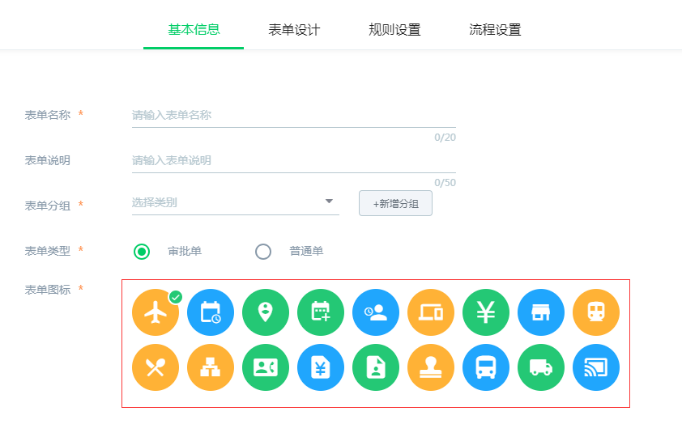

# 常用
h5项目UI框架使用的是vux，目前项目中使用版本为"vux": "^2.9.2"

?> 官网文档https://vux.li/#/
## 1px解决方案
在需要设置的dom上面添加类名
```css
vux-1px-l //左边框
vux-1px-r //右边框
vux-1px-t //上边框
vux-1px-b //下边框
vux-1px-tb //上下边框
vux-1px //全边框
//默认边框颜色是 '#ebedef'
//在上述基础上再添加 'cus-color'类名 修改边框颜色为 '#d2d5db'
```
## 按钮

```html
<x-button @click.native="">取消</x-button>
<br/>
<x-button type="primary" @click.native="">确定</x-button>
<br/>
<x-button class="no-border" @click.native="">取消</x-button>
<br/>
<x-button class="no-border" type="primary" @click.native="">确定</x-button>
<br/>
```
更多用法可参考vux官方文档
## 小按钮

```html
<p>带border</p>
<x-button mini type="primary" @click.native="">确定</x-button>
<x-button mini @click.native="">取消</x-button>
<p>不带border</p>
<x-button class="no-border" mini type="primary" @click.native="">确定</x-button>
<x-button class="no-border" mini @click.native="">取消</x-button>
```

## 提示/弹窗
### 加载中

```html
<Loading v-if="flag" :show="true" text="加载中" transition="''"></Loading>
```
注意：该组件已经全局引入，无需再次引入。transition="''"解决loading背景有穿透现象

如果层级显示有误则可以使用下面的方式
```html
<div v-transfer-dom>
  <Loading v-if="time_loading" :show="true" text="加载中" transition="''"></Loading>
</div>
```
```js
import { TransferDom } from 'vux'
export default{
  directives: {
    TransferDom
  },
```
### 普通toast

```js
this.$vux.toast.text('这里是一个底部提示语', 'bottom')
```
更多用法可参考vux官方文档

### 失败提示弹窗

```js
this.$vux.toast.show({
  type: 'warn',
  text: `<div><i class="iconfont ic_-ic_toast_"></i><p>失败了</p ></div>`,
})
```
### 成功提示弹窗

```js
this.$vux.toast.show({
  type: 'success',
  text: `<div><i class="iconfont ic_-ic_toast_v"></i><p>成功了</p ></div>`,
})
```
### 确认弹框

```html
<confirm
  class="diy_confirm"
  v-model="props_flag"
  title="提示"
  content="这里是提示语"
  confirm-text="知道了"
  @on-cancel=""
  @on-confirm=""
  @on-show=""
  @on-hide="">
  </confirm>
```
需要在使用的时候引入该组件 import { Confirm } from 'vux' 并注册到components里面,由于需要修改vux里面该组件的样式 所以需要注意加上diy_confirm这个类名，更多详细用法与官网一致
### 带有多行输入框的弹框

```html
  <!-- max输入框字数 title对话框标题 -->
  <ipt-confirm 
    :max="100" title="拒绝参会" 
    v-if="dialog" v-model="dialog" @on-ok="dialog=false" />
```
```js
 //用法示例：
 import iptConfirm from '@/components/common/iptConfirm'
 export default {
  // ...
  components: {
     iptConfirm
  },
  //...
 }
```


## 各种类型数据格式化

```js
this.wxBase.dateToStr(new Date(),'yyyy-MM-dd hh:mm')  //日期 格式化 
this.wxBase.unixToStr('1233331213','yyyy-MM-dd hh:mm') //时间戳 格式化
this.wxBase.strToUnix('2018-01-02')//字符时间转时间戳（已做过'-'到'/'的兼容）
this.wxBase.transTime(111111)  //时间戳格式化成今天 昨天 明天等 
this.wxBase.getTimeStr(32600)//时间毫秒转字符串
this.wxBase.getTimeInt('16:25')//时间字符转秒
this.wxBase.changeMoney('1205021')//小写金额转大写
this.wxBase.renderFileSize(1024)//文件大小b单位格式
```

## 空数据提示

```html
  <no-data no_text="暂无内容" />
```
```js
  //用法示例：
  import noData from '../common/no-data'
  export default {
    // ...
    components: {
       noData
    },
    //...
  }
```

## 页面之间标题设置
```js
  document.title = '公告列表'
```
## 图标管理
### 文件类型图标库
```js
  this.wxBase.docIcons['jpg']//传入文件后缀名即可获取该类型文件的图标类型图标颜色
```
 数据格式
### 审批图标
```js
  this.wxBase.approvalIcons['1']//传入审批图标id
```
 数据格式

审批图标id，由管理系统新建审批流程时，选择的图标确定，由左往右依次增大

## 判断系统平台
```js
  this.is_wxModel //是否微信或企业微信
  this.wxBase.is_ios //是否ios
  this.wxBase.is_android //是否Android
  this.wxBase.is_mobelModel //是否移动设备端
```

## 打印日志
```js
  this.wxBase.log('输出内容：',data);
```

## 异步请求-$http

> 详细用法参考 https://github.com/mzabriskie/axios

```js
//项目实例中以 this.$http.. 调用。
this.$http.post('/api/module/...',data)
.then(function (response) {
    console.log(response);
})

//注：项目中接口请求成功会返回code值。code=0时表示请求成功，否则会返回msg。需要根据业务进行合理提示给用户。

```
## 控制台登录账号
```js
DevVue.wxBase.login({ account:'135',password:'Li123456' },id)
```
有多个公司第二个参数填写对应公司id
## 设置token
```js
DevVue.wxBase.setToken('')
```
## 滚动加载/底部追加

```
    https://doc.vux.li/zh-CN/components/scroller.html
```

## 响应式处理

针对宽度尽量换算为百分比的布局。高度可以固定或则进行换算。
```
方式一：媒体查询
/* 350以上 */
@media (min-width: 350px){
  .nav_bar .iconfont{
    font-size: 28px;
  } 
}
/* 550以上 */
@media (min-width: 550px){
  .nav_bar .iconfont{
    font-size: 32px;
  } 
}
/* 750以上 */
@media (min-width: 750px){
  .nav_bar .iconfont{
    font-size: 36px;
  }
}
/* or  */
//小屏
@media (min-width: 350px){
  
}
//中屏
@media (min-width: 550px){
  
}
//大屏
@media (min-width: 750px){
  
}


方式二：rem转换

//定义一个变量和一个mixin
@baseFontSize: 75;//基于视觉稿横屏尺寸/100得出的基准font-size
.px2rem(@name, @px){
    @{name}: @px / @baseFontSize * 1rem;
}

//使用示例：
.container {
    .px2rem(height, 240);
}

//less翻译结果：
.container {
    height: 3.2rem;
}

```


----------
　

　

　

　

　

　

　

　

　

　


