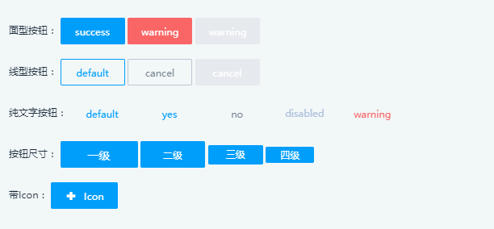
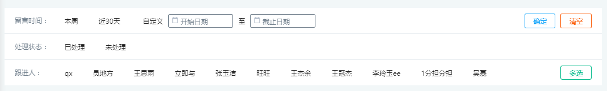
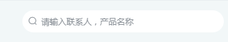
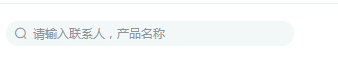
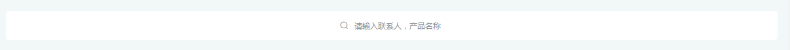
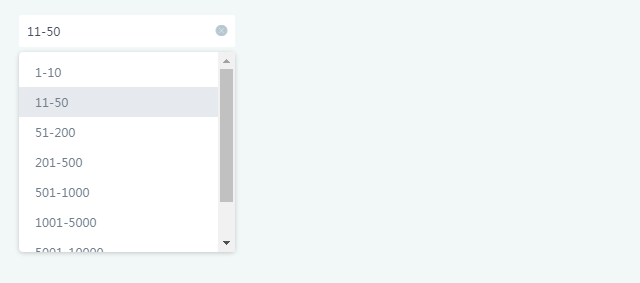
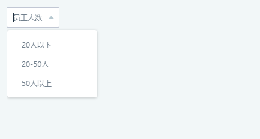

# 公共UI

## 常用按钮



```html
        面型按钮：
            <Button type="success">success</Button>
            <Button type="warning">warning</Button>
            <Button type="warning" disabled>warning</Button>

            线型按钮：
            <Button class="g-btn-default">default</Button>
            <Button class="g-btn-cancel">cancel</Button>
            <Button class="g-btn-cancel" disabled>cancel</Button>

            纯文字按钮：
            <Button type="text">default</Button>
            <Button type="text" class="g-btn-yes">yes</Button>
            <Button type="text" class="g-btn-no">no</Button>
            <Button type="text" disabled>disabled</Button>
            <Button type="text" class="g-text-warning">warning</Button>

            按钮尺寸：
            <Button type='success' class="btn-size-large">一级</Button>
            <Button type='success' class="ivu-btn-small">二级</Button>
            <Button type='success' class="btn-size-xs">三级</Button>
            <Button type='success' class="btn-size-xss">四级</Button>

            带Icon：
            <Button type="success">
              <div class="btn_logo">
                <i class="iconfont-s ics-xinjian"></i>
                Icon
              </div>
            </Button>
```
## 常用筛选配置
```javascript
//注意 filterList：title为数组  advancedFilterList：title为string
//组件 props：filterList [Array]属性说明
const filterList = [{
  type:"date",//string 必填 date:日期筛选，radio:单选，checkbox:多选，country:国家筛选
  field:"field1",//string 必填且唯一， 获取筛选结果的key
  title:["标题：","(副标题)"],//array 必填
  data:[{
    label:"显示名称",//string 必填
    value:"传给后端值",//必填
    icon:"icon-name",//string 选填
  }]
}];
//组件 props：advancedFilterList [Array]属性说明
const advancedFilterList = [{
  type:"date",//string 必填 date:日期筛选，radio:单选，checkbox:多选，country:国家筛选
  field:"field2",//string 必填且唯一， 获取筛选结果的key
  title:"标题",//string 必填
  expend:false,//boolean 选填 默认是否展开
  data:[{
    label:"显示名称",//string 必填
    value:"传给后端值",//必填
    icon:"icon-name",//string 选填
  }]
}];
/* 特别说明： type为country时，data应为二维数组
data:[
      [{
        label:"显示名称",//string 必填
        value:"传给后端值",//必填
        initial:"首字母",//string 必填
        icon:"icon-name",//string 选填
      }],//未展开时列表数据
      [{
        label:"显示名称",//string 必填
        value:"传给后端值",//必填
        initial:"首字母",//string 必填
        icon:"icon-name",//string 选填
      }]//展开时列表数据
    ]
*/
```

例如



```javascript

// 引入组件
  import listFilter from '@/components/listFilter/index';

// 使用组件
<listFilter :filterList="filterList" :advancedFilterList="advancedFilterList" @on-update="update" />
//组件 event：on-update 事件说明: 当列表筛选数据发生变化，emit此事件  返回值格式为： {field1:"",field2:""}

```

## 搜索框



```html
     <go-type-filter
        type="find"
        placeholder='请输入联系人，产品名称'
        v-model=""
        @on-blur=""
        @on-focus=""
        @on-click=""/>
```


```html
    <go-type-filter
            type="find"
             class="g-filter-right-icon"
            placeholder='请输入联系人，产品名称'
            v-model=""
            @on-blur=""
            @on-focus=""
            @on-click=""/>
```



```html
     <go-type-filter
        type="find"
        class='other'
        placeholder='请输入联系人，产品名称'
        v-model=""
        @on-blur=""
        @on-focus=""
        @on-click=""/>
```



```html
    <!--要指定父元素的宽度和盖度-->
     <go-type-filter
        type="fullFind"
        placeholder='请输入联系人，产品名称'
        v-model=""
        @on-blur=""
        @on-focus=""
        @on-click=""/>
```

## 无边框下拉框



```html
<go-type-filter type="other" placeholder="员工人数" v-model="" @on-change="">
      <Option value="1">20人以下</Option>
      <Option value="2">20-50人</Option>
      <Option value="3">50人以上</Option>
    </go-type-filter>
```

## 有边框下拉框



 ```html
 <go-type-filter type="other" border placeholder="员工人数" v-model="" @on-change="">
       <Option value="1">20人以下</Option>
       <Option value="2">20-50人</Option>
       <Option value="3">50人以上</Option>
     </go-type-filter>
```
　

　

　

　

　

　

　

　

　

　
