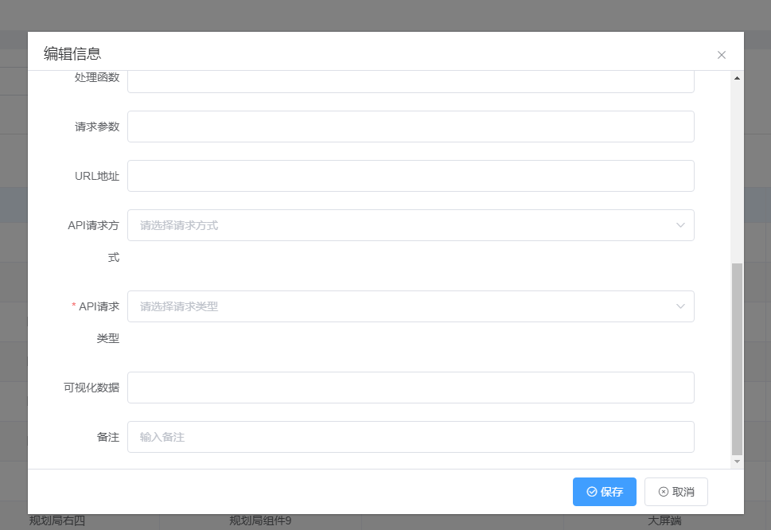
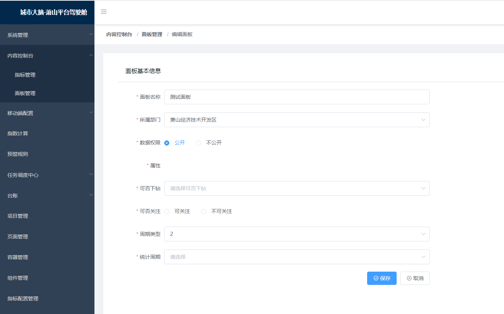

# 开发流程
## 数据对接与配置地址
?> 驾驶舱后台管理系统http://10.162.12.170:8090/admin/#/project

?> 数据中台实施数据https://docs.qq.com/sheet/DT2pkdE9EdXVXZU1D?tab=2h6ynk
## 页面搭建过程
1、在驾驶舱后台管理系统-项目管理--创建项目  
2、在驾驶舱后台管理系统-页面管理--新增页面  
3、在驾驶舱后台管理系统-容器管理--新增容器  
4、在驾驶舱后台管理系统-组件管理--新增组件
## 页面构成

> 容器(面板)：

页面的直接组成部分，由若干个容器排序定位构建成一个完整的页面  

> 组件：

容纳一个个指标，组成容器,形成页面上的某一个部分  

> 指标：

数据项  

## 页面管理
找到刚刚新增的页面，然后绑定需要的容器

## 容器管理


录入相应信息，其中  
组件： 需要选取需要装载的组件  
接口类型：如果选取了内部接口，就需要去选择相应的面板，带出指定接口  
排序号 ：页面容器的排列顺序  
可视化数据：如果不需要动态数据，可以直接将静态数据配置在这里  
处理函数：将接口数据处理成组件识别的数据
## 组件管理
录入对应信息

组件编码：要和代码里面的组件名称对应，名称尽量以cp开头
```js
import CpListCmp from "@/components/list/index"
****
components:{CpListCmp}
```
可视化数据：默认会传递到使用该组件的容器里面的可视化数据去
## 面板
这里主要与指标有关联，目前面板都是由实施人员配置，开发暂时没介入  
配置完面板后，在容器选择层就可以选择相应的面板，并带出接口


## 页面展示过程
> render模式：

```js
handleContainerClass(item) {//生成一个className
    return `container-${item.componentCode}-${item.orderNo}`;
},
formatData(item, data) {//基于转换函数实现接口数据--->组件数据
    if (!item.dataUrl) {
        return;
    } else {
        if (item.dealFunction) {
          item.config = new Function("res", item.dealFunction)(data);
        } else {
          item.config = data;
        }
    }
},
getContainers() { //获取当前页面的所有容器
    getContainersByPageId({
        pageId: this.pageId
    })
    .then(({ success, data }) => {
        if (!success || !data) {
        throw new Error("data error")
        }
        return data
    })
    .then(data => {
        return data.sort((a, b) => a.orderNo - b.orderNo)
    })
    .then(data => {
        const length = data.length;
        data.forEach(item => {
        if (!item.dataUrl) {//没配置了容器接口，取可视化数据
            item.config = {
                title: item.containerName,
                ...JSON.parse(item.jsonData)
            }
            this.formatData(item, item.jsonData)
            this.isFinished(length, data)
        } else {
            getPanelDataById(item.dataUrl)// 请求容器接口
            .then(res => {
                this.formatData(item, res)
                this.isFinished(length, data)
            })
            .catch(() => {
                this.isFinished(length, data)
            })
            }
        })
    })
    .catch(err => {
        console.error(err)
    });
    },
    renderContainers(h) {// 渲染容器
      return this._l(this.containerList, (item, index) => {
        return (
          <Panel
            key={index}
            title={item.containerName}
            minTitle={item.minTitle}
            class={this.handleContainerClass(item)}
          >
            {h(item.componentCode, {
              props: {
                config: item.config,
                ...item
              }
            })}
          </Panel>
        );
      });
    },
    // 使用空白节点占位
    renderCustom() {
      return this._e();
    }
```
> 模板模式：

```html
<template>
  <div class="planning-resource">
    <twoLevelTitle :title="tLTitle" />
    <div class="planning-resource-content">
      <component
        v-for="(item, index) in containerList"
        :key="index"
        ref="views"
        :is="item.componentCode"
        :config="item.config"
        :class="`planning-resource-content-${item.orderNo}`"
      />
    </div>
  </div>
</template>
```

## 组件交互过程
主要基于ref 、eventBus、provide/inject实现